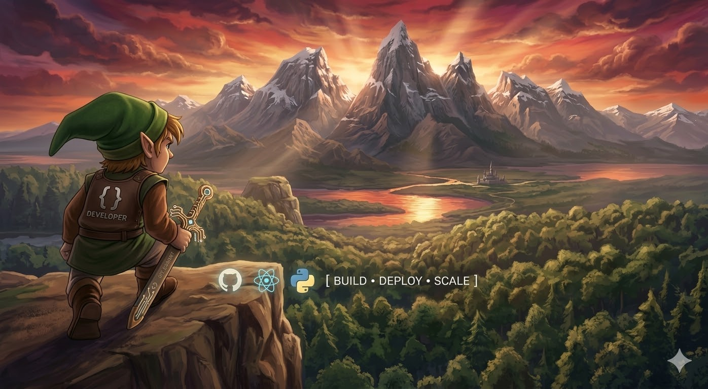

# Hi, I'm James Nguyen
**Software Developer | Data Engineer | Generative AI Engineer**

📍 Dallas, TX  
🔗 [LinkedIn](https://www.linkedin.com/in/tnguyen77/)

  

---

## About me - 

I build production-grade backend, data, and AI systems with a focus on scale, reliability, and measurable business impact.

- Design and ship distributed data pipelines and backend services
- Build GenAI applications with retrieval, orchestration, and evaluation workflows
- Deliver cloud-native systems across batch and real-time workloads
- Apply strong engineering fundamentals in algorithms, system design, and ownership

---

## Core Strengths 

- **Scalable System Design:** backend and data architectures for high throughput and reliability
- **Data + AI Integration:** LLM applications connected to governed data platforms
- **Distributed Processing:** batch and streaming pipelines using modern big-data tooling
- **Cloud Execution:** production delivery on AWS with serverless and data services
- **Engineering Discipline:** clean code, CI/CD, observability, and end-to-end ownership

---

## Technical Skills

### AI and Language Engineering
- Prompt engineering
- LLM orchestration with LangChain and LangGraph
- RAG and vector search
- ChromaDB and vector database workflows

### Languages
- Python, SQL, JavaScript, TypeScript, Shell
- Java, Scala
- ReactJS, Node.js

### Data Science and Analytics
- NumPy, Pandas, Matplotlib, Scikit-learn

### Big Data and Distributed Systems
- Apache Spark (PySpark), Hadoop, Hive, HDFS
- Kafka, Presto, Polars

### Cloud and Data Platforms
- AWS: Bedrock, S3, Glue, Redshift, Athena, Lambda, RDS, Kinesis, SNS/SQS, CloudWatch
- Snowflake
- Exposure to Azure and GCP (Vertex AI)

### Data Engineering and ETL
- Data pipeline design and orchestration
- Ingestion and transformation
- Real-time streaming
- Data lake and warehouse patterns
- Airflow, Terraform, Kinesis

### Backend and APIs
- FastAPI, Flask, Django
- REST API design
- AWS API Gateway and Lambda
- Serverless workflows
- Familiarity with Spring Boot

### Databases
- PostgreSQL, MySQL, Redshift, MongoDB

### DevOps and Tooling
- Docker, Kubernetes, Jenkins
- Git, GitHub Actions, CI/CD
- AWS ECS, Bitbucket, Splunk

### Data Formats
- JSON, CSV, Parquet, Avro, ORC

---

## Projects

### Flask-Flashcards
Backend web application demonstrating API design, data modeling, and product execution.  
Repo: https://github.com/jwin-sudo/Flask-Flashcards

### Java-Solutions
Algorithms and data structure practice for interview-grade problem solving.  
Repo: https://github.com/jwin-sudo/Java-Solutions

### React-Express-App
Full-stack app demonstrating frontend-backend integration and service design.  
Repo: https://github.com/jwin-sudo/React-Express-App

---

## GitHub Metrics

---

## Contact

📧 Email: jamesnguyen649@gmail.com  

---

Open to Software Engineer, Data Engineer, and Applied AI Engineer opportunities.